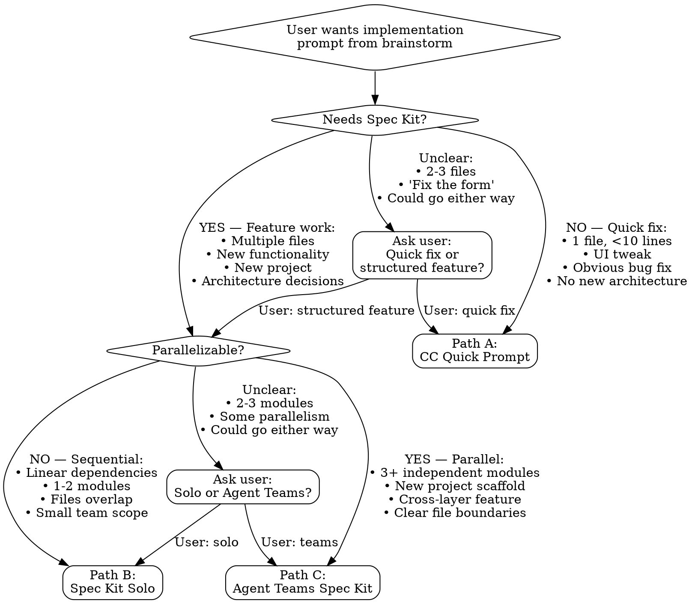

# Implementation Prompt Generator

Transform brainstorming output into the right implementation prompt for the job — whether that's a quick Claude Code prompt, a Spec Kit `/speckit.specify` for solo work, or an Agent Teams `/speckit.specify` for parallel work.

## Core Principle

**One skill, three outputs.** The brainstorming-to-implementation handoff always follows the same analysis process. What changes is the *format* and *detail level* of the output, based on the complexity and parallelizability of the work.

## Decision Flow

Two sequential decisions route to the correct path:



### Decision 1: Quick CC Prompt or Spec Kit?

**Auto-route to CC Quick Prompt (Path A) if:**
- Modifying a single file
- Less than 10 lines of code
- Pure UI adjustment (colors, spacing, text)
- Obvious bug fix with clear solution
- No architectural decisions needed

**Auto-route to Spec Kit (Path B or C) if:**
- Creating or modifying multiple files
- Adding new functionality or user flows
- Starting a new project
- Architectural decisions involved
- User explicitly mentions "spec", "specify", or "Spec Kit"

**Ask user when:**
- 2-3 files involved but changes are straightforward
- "Fix the form" or similar — could be a quick fix or a restructure
- User says "create prompts" without indicating complexity

Clarification format:
"This could go two ways. Which fits better?
• **Quick prompt** — straightforward fix, 1-2 files, no architecture changes
• **Spec Kit feature** — new functionality, multiple files, needs structured planning"

### Decision 2: Solo or Agent Teams?

Only reached if Decision 1 routes to Spec Kit.

**Auto-route to Solo Spec Kit (Path B) if:**
- Feature touches 1-2 modules or directories
- Tasks have linear dependencies (each step depends on the previous)
- Multiple teammates would edit the same files
- Scope is contained to one area of the codebase

**Auto-route to Agent Teams (Path C) if:**
- Feature touches 3+ independent modules or directories
- Building a new project from scratch with multiple domains
- Cross-layer work (frontend + backend + tests + data layer) with clean file boundaries
- User explicitly mentions "agent teams", "parallel", or "teammates"

**Ask user when:**
- 2-3 modules with some but not clear parallelism
- Feature could reasonably be done either way
- File ownership boundaries are unclear

Clarification format:
"This feature has some natural divisions. Agent Teams is faster but costs more tokens (~5x per teammate). Which fits?
• **Solo** — you'll implement sequentially in one Claude Code session
• **Agent Teams** — multiple Claude Code agents work in parallel on separate modules"

### Example Routing

| Request | Decision 1 | Decision 2 | Path |
|---------|-----------|-----------|------|
| "Change the button color on checkout page" | 1 file, UI tweak → CC | — | **A: CC Quick** |
| "Add a voting system with Firestore persistence" | New feature, multiple files → Spec Kit | 1 module, linear → Solo | **B: Spec Kit Solo** |
| "Build trading system: state machine, Firebase sync, UI, tests" | New feature, architecture → Spec Kit | 4 independent modules → Teams | **C: Agent Teams** |
| "Fix the login bug" | Unclear → Ask | — | **Ask → A or B** |
| "Add user profiles and search and booking and payments" | New project, multiple domains → Spec Kit | 4+ independent domains → Teams | **C: Agent Teams** |
| "Refactor the auth module for better error handling" | Multiple files → Spec Kit | 1 module → Solo | **B: Spec Kit Solo** |

---

## Path A: CC Quick Prompt

For simple, single-file or obvious changes that don't need Spec Kit's planning overhead.

### When to Use
- Task is obvious and straightforward
- Claude Code doesn't need architectural guidance
- No ambiguity about what to do
- Single file, few lines changed

### Simple Template

```markdown
Change [specific element] in [filename]:
- [Specific change 1]
- [Specific change 2]

File: [path/to/file.js]

Expected result: [One sentence describing outcome]
```

### Full CC Prompt Template

Use when the task is still direct CC work (no Spec Kit needed) but involves more context:

```markdown
## Task
[One-sentence clear description]

## Context
[What exists now, relevant background]

## Requirements
- [Specific, testable requirement 1]
- [Specific, testable requirement 2]

## Tech Stack & Constraints
- [Framework, deployment, build constraints]
- [Any specific technical requirements]

## File Structure
[Files to create/modify]

## Success Criteria
- [ ] [Testable outcome 1]
- [ ] [Testable outcome 2]
- [ ] No console errors
```

### CC Prompt Guidelines

Read `references/cc-prompt-guide.md` for:
- Tech stack defaults (zero-build philosophy, Firebase, Vercel)
- Security context templates
- Common patterns (Firebase, UI components, Chrome extensions)
- Token optimization tips
- Examples by type (new feature, bug fix, code review)

### Output Format

```
Here's your Claude Code prompt, ready to paste:

```
[generated prompt]
```

**Next step:** Paste this into Claude Code in VS Code and implement.
```

---

## Path B: Spec Kit Solo

For medium-to-complex features that benefit from structured planning but will be implemented by a single Claude Code session.

### Process

1. **Analyze brainstorming context** — extract design decisions, technical constraints, feature requirements, scope boundaries, success metrics
2. **Read reference guides** — `references/constitution-guide.md` and `references/specify-guide.md`
3. **Generate /speckit.constitution** (new projects only)
4. **Generate /speckit.specify**
5. **Format output** with next steps

### /speckit.constitution Template (new projects only)

```
/speckit.constitution

We are building [project description].

**Tech Stack:**
- [Specific technologies and versions]
- [Deployment platform]
- [Database/backend services]

**Architecture:**
- [Key architectural decisions]
- [Build/dependency approach]

**Code Quality:**
- [Testing requirements]
- [Documentation standards]
- [Performance targets]

**Development Workflow:**
- [Version control practices]
- [Deployment process]
```

### /speckit.specify Template

```
/speckit.specify

[Feature name/project name]

**User Need:**
[What problem this solves and why it matters]

**Core Functionality:**
1. [User-facing capability 1]
2. [User-facing capability 2]
3. [User-facing capability 3]

**User Flows:**
- [Primary user journey with steps]
- [Secondary user journey]

**Success Criteria:**
- [Measurable metric 1]
- [Measurable metric 2]

**Scope:**
In scope: [What this includes]
Out of scope: [What's deferred to future phases]

**Assumptions:**
- [Reasonable defaults documented]
```

### Key Principles
- **Constitution = HOW we build** (tech stack, patterns, quality standards)
- **Specify = WHAT we build** (user needs, features, success criteria)
- Focus on user value, not implementation details
- Be concrete and testable — avoid vague language
- Make informed assumptions rather than excessive [NEEDS CLARIFICATION] markers
- Document scope boundaries explicitly

### Output Format

```
Here are your Spec Kit prompts, ready for Claude Code:

**Constitution Prompt** (new projects only):
```
/speckit.constitution
[generated constitution]
```

**Specify Prompt:**
```
/speckit.specify
[generated specify]
```

**Next Steps:**
1. Open your project in VS Code with Claude Code
2. If new project: paste /speckit.constitution first
3. Paste the /speckit.specify prompt
4. Use /speckit.plan and /speckit.tasks to continue
5. Implement with Claude Code, push to GitHub, deploy via Vercel
```

---

## Path C: Agent Teams Spec Kit

For complex, parallelizable work where multiple Claude Code agents can work simultaneously on separate modules.

### Process

1. **Analyze brainstorming context** — same as Path B, plus: identify module boundaries, shared interfaces, dependency ordering
2. **Identify teammate roles** — break work into 2-6 teammates with non-overlapping file ownership
3. **Define dependency waves** — which teammates spawn first, which work in parallel after
4. **Write interface contracts** — exact function signatures, data shapes, event names at every cross-teammate boundary
5. **Read reference guides** — `references/constitution-guide.md`, `references/specify-guide.md`, and `references/agent-teams-additions.md`
6. **Generate /speckit.constitution** (new projects only, with Agent Teams additions)
7. **Generate /speckit.specify** (with Agent Teams sections)
8. **Format output** with Agent Teams-specific next steps

### Teammate Definition Rules

**Each teammate MUST own distinct files/directories.** Two teammates editing the same file causes overwrites — no merge conflict resolution exists.

**Split by vertical slice (feature), not horizontal layer.** Each agent owns both frontend and backend for their module, rather than one agent owning "all frontend."

**Exception:** Foundation work (auth, data models, core utilities) gets its own Wave 1 teammate.

**Detect soft foundations:** After defining teammates, scan for any teammate whose output (types, interfaces, data models, shared utilities) is consumed by 2+ other teammates. Even if that teammate also builds feature code, it should be Wave 1 — or its shared types should be split into a separate Wave 1 teammate. Signs of a soft foundation:
- Teammate defines TypeScript types/interfaces other teammates import
- Teammate creates database schemas other teammates read/write
- Teammate builds utility functions other teammates call
- Teammate's "Owns" directory includes a `types/` or `shared/` folder

If a teammate is both a foundation AND a feature builder (e.g., "Trade Logic" defines types AND implements business logic), split it: Wave 1 teammate creates just the types/interfaces/contracts, Wave 2 teammate implements the full logic using those types. This prevents Wave 2 teammates from waiting on a large Wave 1 task when they only need the type definitions.

**Optimal team size:**
- 2-3 teammates for a complex feature in an existing project
- 4-6 teammates for a new project or major new domain
- Never more than 6 — coordination overhead exceeds benefit
- 5-6 tasks per teammate is the sweet spot

### Dependency Waves

**Wave 1 — Foundation (spawn first):** Teammates whose output is needed by others. Data models, auth, shared interfaces. 1-2 teammates max.

**Wave 2 — Parallel Features (spawn after Wave 1):** Independent feature work. All Wave 2 teammates spawn simultaneously. No Wave 2 teammate should depend on another Wave 2 teammate.

**Wave 3 — Integration (optional):** Lead agent or dedicated teammate wires modules together and runs integration tests.

### Interface Contracts

**Contracts MUST be centralized in a dedicated section of the spec, NOT scattered across individual spawn prompts.** This is critical — when contracts are embedded in each agent's prompt, Agent 6 (coordinator) has no single source of truth to reconcile against, and agents may interpret the same interface differently.

For every point where teammates' code must interoperate, define a named contract:
- **Function signatures** — exact names, parameters, return types
- **Data shapes** — object/document structures both sides agree on
- **Event/callback signatures** — if using pub/sub, events, or callback props
- **Database schemas** — collection/document structures for shared data
- **API endpoints** — if teammates build different parts of an API

**Contract naming convention:** Use descriptive names that both the producing and consuming teammates can reference (e.g., "Trade State Machine API", "User Model Schema", "Chat-to-Trade Bridge Events").

**Cross-referencing rule:** Spawn prompts reference contracts by name ("Follow the Trade State Machine API contract in the Interface Contracts section") rather than duplicating the contract details. This ensures a single source of truth. If a contract needs to change, it changes in one place.

**Handoff declarations:** Each contract should specify:
- **Produced by:** which teammate creates this interface
- **Consumed by:** which teammates code against it
- **Ready signal:** how the producer notifies consumers (e.g., "message teammates that types are exported")

Read `references/agent-teams-additions.md` for detailed contract examples and patterns.

### /speckit.constitution Additions (Agent Teams)

Add this section to the standard constitution:

```
## Agent Teams Configuration

**Team coordination:**
- Enable delegate mode automatically — lead agent coordinates only, does not implement
- Each teammate owns specific directories (defined in spec)
- No teammate modifies files outside their assigned directories
- Shared interfaces are defined in the spec and must not be changed unilaterally

**File ownership enforcement:**
- [Teammate 1 name]: [directory paths]
- [Teammate 2 name]: [directory paths]
```

### /speckit.specify Template (Agent Teams)

Uses the same top section as Path B (User Need, Core Functionality, User Flows, Success Criteria, Scope, Assumptions), plus these additional sections:

```
---

## Agent Teams Implementation Structure

### Teammate Definitions

**Teammate 1 — [Role Name]**
- **Owns:** [directory/file paths]
- **Responsibility:** [What this teammate builds]
- **Depends on:** [Nothing / Teammate X completing Y]
- **Wave:** [1 / 2 / 3]

[Repeat for each teammate]

### Dependency Waves

**Wave 1 (spawn first):**
- Teammate [X]: [What they produce that others need]

**Wave 2 (spawn after Wave 1 completes):**
- Teammates [Y, Z]: [Work in parallel]

**Wave 3 — Integration (optional):**
- Lead or dedicated teammate: [Integration tasks]

### Interface Contracts

**Contract: [Name — e.g., "Trade State Machine API"]**
- **Produced by:** Teammate [X]
- **Consumed by:** Teammates [Y, Z]
```
[Function signatures, data shapes, or API endpoints]
```

**Contract: [Name — e.g., "Chat-to-Trade Bridge Events"]**
- **Produced by:** Teammate [X]
- **Consumed by:** Teammate [Y]
```
[Event names, callback signatures, payload shapes]
```

[Repeat for each cross-teammate boundary]

### Spawn Prompt Blueprints

**Teammate 1 — [Role Name]:**
"You are implementing [responsibility] as defined in the project spec.
Your files are in [directory paths]. You PRODUCE the following interface
contracts: [contract names]. Export these interfaces exactly as defined
in the Interface Contracts section. Do not modify files outside your
assigned directories. Acceptance criteria: [criteria]. When done, mark
tasks complete and message [dependent teammates] that your interfaces
are ready."

**Teammate 2 — [Role Name]:**
"You are implementing [responsibility] as defined in the project spec.
Your files are in [directory paths]. You CONSUME the following interface
contracts: [contract names] — follow them exactly as defined in the
Interface Contracts section. Do not modify files outside your assigned
directories. Acceptance criteria: [criteria]. When done, mark tasks
complete."

[Repeat for each teammate]

### Agent Teams Execution Directive

**This section goes at the end of every Path C `/speckit.specify` output.** It tells Claude Code to create and run the agent team automatically, so the user doesn't have to invoke it separately.

```
---

## Execution Directive

After processing this specification, follow these steps:

**Planning constraint:** When generating the plan via /speckit.plan, use the
file structure and directory ownership defined in the Teammate Definitions above.
Do not reorganize files into a different structure — the teammate assignments
depend on these exact directory boundaries. If the plan suggests a different
architecture, reconcile it with the teammate ownership map before proceeding.

**Execution steps — run automatically after /speckit.plan and /speckit.tasks:**

1. Enable delegate mode — coordinate only, do not implement tasks yourself
2. Create an agent team based on the Teammate Definitions above
3. Spawn Wave 1 teammates using their Spawn Prompt Blueprints
4. Wait for Wave 1 to complete before spawning Wave 2
5. Spawn all Wave 2 teammates simultaneously using their Spawn Prompt Blueprints
6. Assign each teammate ONLY the files/directories listed in their "Owns" field
7. Monitor teammate progress and redirect if any teammate drifts from scope
8. After all teammates complete, run Wave 3 integration (if defined) or
   synthesize results and verify all interface contracts are satisfied
9. Run a final review against the Success Criteria before marking complete
```

### Output Format

```
Here are your Agent Teams Spec Kit prompts, ready for Claude Code:

**Constitution Prompt** (new projects only):
```
/speckit.constitution
[generated constitution with Agent Teams section]
```

**Specify Prompt:**
```
/speckit.specify
[generated specify with Agent Teams sections, ending with Execution Directive]
```

**Next Steps:**
1. Open your project in VS Code with Claude Code extension
2. If new project: paste /speckit.constitution first
3. Paste the /speckit.specify prompt — Claude Code will handle delegate mode,
   team creation, and task assignment automatically after /speckit.plan and
   /speckit.tasks complete
4. Monitor teammates: Shift+Up/Down to cycle, Ctrl+T for task list
5. After completion, review integration and push to GitHub
6. Deploy via Vercel to test
```

---

## Common Mistakes (All Paths)

### ❌ Too vague
"Add a feature to make the app better"
**Fix:** Be specific — "Add keyboard shortcut (Cmd+K) to open search modal"

### ❌ Missing tech stack
"Build a login system"
**Fix:** Include constraints — "Firebase Auth with Google OAuth, no build tools"

### ❌ No success criteria
"Fix the bug"
**Fix:** Define success — "ESC closes modal, focus returns to trigger, works in all browsers"

### ❌ Wrong path chosen
Using Agent Teams for a 1-file fix, or a CC prompt for a 6-module feature
**Fix:** Follow the decision flow — let complexity and parallelizability guide the choice

### ❌ Agent Teams: overlapping file ownership
Two teammates editing src/components/
**Fix:** Each teammate gets dedicated directories

### ❌ Agent Teams: missing interface contracts
Teammates build incompatible APIs
**Fix:** Define every cross-teammate boundary with exact signatures and data shapes

### ❌ Agent Teams: contracts scattered in spawn prompts
Each agent gets contract details in their prompt — no single source of truth, coordinator can't reconcile
**Fix:** Centralize ALL contracts in one Interface Contracts section. Spawn prompts reference by name only.

### ❌ Agent Teams: flat wave structure when soft dependencies exist
A teammate defines shared types AND implements features — all agents in Wave 2 wait for the full implementation
**Fix:** Split the types/interfaces into a small Wave 1 teammate, let the feature implementation run in Wave 2 alongside others

### ❌ Agent Teams: no dependency ordering
All teammates spawn at once but some need others' output
**Fix:** Define waves — foundation first, parallel features second

## Quality Checklist

**For all paths:**
- [ ] Task description is specific and testable
- [ ] Success criteria are measurable checkboxes
- [ ] Tech stack constraints are explicit

**Additional for Spec Kit (Path B):**
- [ ] Focuses on WHAT and WHY, not HOW
- [ ] Scope boundaries are clear (in/out)
- [ ] Assumptions are documented

**Additional for Agent Teams (Path C):**
- [ ] Every teammate has non-overlapping file ownership
- [ ] Dependency waves defined (no circular dependencies)
- [ ] Soft foundations identified (type/interface producers are Wave 1)
- [ ] Interface contracts centralized in one section with Produced by / Consumed by
- [ ] Spawn prompts reference contracts by name, never duplicate details
- [ ] Spawn prompts are complete for cold-start agents
- [ ] No Wave 2 teammate depends on another Wave 2 teammate
- [ ] 2-6 teammates total, 5-6 tasks each
